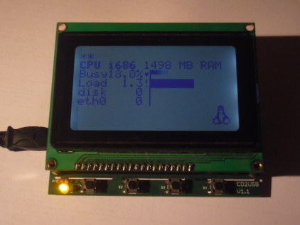
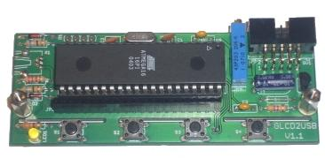
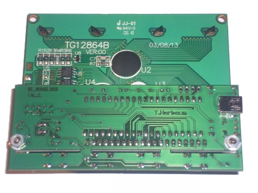
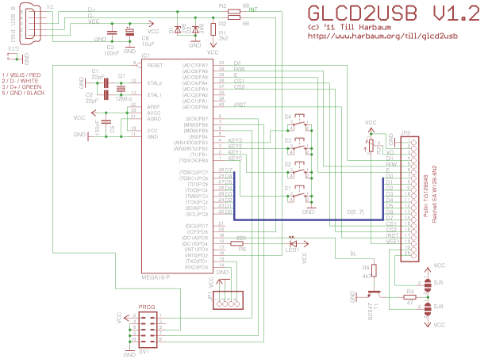
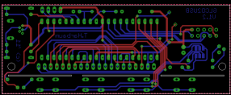
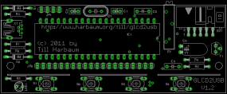
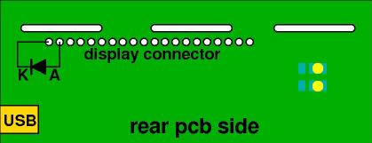
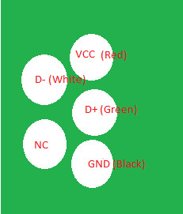

# GLCD2USB

GLCD2USB is the graphic display capable descendant of the [LCD2USB](https://github.com/harbaum/LCD2USB). While the LCD2USB was meant to connect text LCDs via USB to a PC, GLCD2USB does the same for some common graphic LCD modules. While the LCD2USB made use of the fact that there's a quasi standard for text LCD controllers, the GLCD2USB needs to cope with various graphic LCD controllers available. The GLCD2USB was thus designed for maximum flexibility and the number and types of supported displays can easily be increased by providing matching modified firmware versions. However, currently only 128x64 ks0108 based displays are supported.



GLCD2USB is currently supported by [lcd4linux](http://ssl.bulix.org/projects/lcd4linux/). Since May '12 [serdisplib](http://serdisplib.sourceforge.net/) also supports the glcd2usb.

Every now and then i have spare PCBs (11 Euro each) and flashed and tested CPUs available. Send me an email if you are interested.

## Hardware

  | 
 ---- | ----
**GLCD2USB without display** | **On pcb V1.1 the USB connector was mounted on the rear PCB side**

**Important**: Unlike pcb V1.1 depicted above, the current pcb layout V1.2 has the USB connector mounted from the front side (the same side all other parts are mounted as well)!

### Schematics and pcb layout

[](images/schematic_full.png)
[](images/pcb_full.png)
[](images/parts_full.png)

## Supported display types

The GLCD2USB concept is meant to support various different display types. Currently a version is available to directly attach to some of the popular ks0108 based displays like the Displaytech 64128A (available e.g. from [Reichelt](http://www.reichelt.de)) or the TG12864B (verified to work, available e.g. from [Pollin](http://www.pollin.de)) or the [Buydisplay --ERM12864DNS-2](http://www.buydisplay.com/default/graphic-display/128x64-dots?cotroller_ic=470)

The GLCD2USB features 16 firmware configurable interface lines (AVR ports A and C) which will allow to connect the GLCD2USB to virtually any intelligent graphic display out there. However, currently only a hardware design and a firmware for certain ks0108 based displays have been developed. Further hardware versions with a matching firmware solution may support other controllers as well.

### Required parts

You can get all parts in germany from Reichelt or Conrad. Or in APAC from Element14.    

 Part | Qty | Name | [Reichelt](http://www.reichelt.de) | [Conrad](http://www.conrad.de) | [Maplin UK](http://www.maplin.co.uk) | [Element14](http://element14.com)
 ---- | ---- | ---- | ---- | ---- | ---- | ----
 Q1 | 1 | 16Mhz crystal, HC49U package | 16,0000-HC49U-S | 155145 | RR89W | 1701139
 R1 | 1 | 2.2k ohm resistor | 1/4W 2,2k | 403270 | M2K2 | 1127929
 R2, R3 | 2 | 68 ohm resistor | 1/4W 68 | 403113 | M68R | 1128049
 R4 | 1 | 47 ohm resistor | 1/4W 47 | 403091 | M47R | 1126986
 R5 | 1 | 220 ohm resistor | 1/4W 220 | 403172 | M220R | 1128007
 R6 | 1 | 4.7k ohm resistor | 1/4W 4,7k | 403334 | M4K7 | 1128937
 C1, C2 | 2 | 22pF ceramic capacitor, 2.54mm | KERKO 22P | 457167 | RA34M | 1600966
 C3, C5 | 2 | 100nF capacitor, 5.08mm | X7R-5 100N | 453358 | RA49D | 1600820
 C6 | 1 | 10μF electrolytic capacitor | RAD 10/35 | 472484 | AT98G | 1823702
 T1 | 1 | BC547C transistor | BC 547C | 154989 | QQ14Q | 2453321
 S1, S2, S3, S4 | 4 | push button | TASTER 9305 | 700460 | KR89W | 1712978
 SV1 | 1 | 10 pin ISP connector | WSL 10W | 742365 | JB85G | 1298795
 JP1 | - | serial connector, for debugging only | - | - | - | - 
 JP2 | 1 | display connector | BL 1X20G8 2,54 | 734993 | --- | -
 -- | 1 | display side connector for JP2 | SL 1X36G 2,54 | 744018 | JW59P | -
 LED1 | 1 | LED 3mm green | LED 3MM GN | 184713 | WL33L | -
 X1 | 1 | mini USB-B print connector | USB BWM | ??? | --- | -
 IC1 | 1 | Atmega16-16 DIP | ATMEGA 16-16 DIP | 154242 | --- | 9171142
 -- | 1 | socket for IC1 | GS 40P | 184882 | HQ38R | 4285669
 D1, D2 | 2 | 3.6V zener diode | ZF 3,6 | 180050 | QH03D | 1861480
 R7 | 1 | 10k precision variable resistor | 962-20 10K | 425109 | WR49D | 1141462
 -- | 1 | Display | LCD 128X064 BL, LCD 64128A LED | 187429, 187433 | --- | -

Additionally required: Display, Mini USB cable

#### Part list remarks

The crystal should be in the small HC49U package. You can use a crystal in HC18 package, but you'd then have to mount it from the rear pcb side.

C1 and C2 should have their pins 2.54mm (1/10 inch) apart, C3 and C5 have their pins 5.08mm (2/10 inch) apart.

Although T1 is labeled BC547C, a BC547A or BC547B will be fine as well. Also tested working with a BC337

If the backlight of the display draws more current than the 100mA the BC547 can handle a BC447 or BS170 may be used instead. I have not tested this and feedback is welcome. I have unknowingly been running the BC547 with a display drawing over 120mA without any problems, but using a transistor specified for the required current sure is a good idea.

D1 and D2 must be 1/2w (500mA) or less. Otherwise you will encounter USB issues.

### Contrast voltage supply

Some contrast voltage has to provided to basically any LCD in order to generate readable output at a useful contrast. Without proper contrast voltage a LCD won't display anything. Unlike e.g. the HD44780 controllers used with the [LCD2USB](../lcd2usb), the KS0108 needs a negative contrast voltage. This is provided by the display controller itself and needs to be fed back into it. Since the AVR CPU can't easily work with negative voltages, the contrast is not software controlled but by the variable resistor R7.

### Backlight polarity

Most of the 20 pin connector seems to be the same for many 128x64 ks0108 displays. But you should still carefully verify the pinout of the display you are going to use. One frequent difference between different displays seems to be the polarity of the backlighting. The GLCD2USB contains two SMD solder jumpers in the rear side below the programming connector. Please take care to close for the current polarity on your used by your display. Using the wrong polarity might damage the backlight of your display.

If the backlights cathode (GND) is on pin 19 and the anode (VCC) is on pin 20 then the innermost SMD pads are to be connected as seen on the left image below. If the cathode of the displays backlight LED is on pin 20 and the anode on pin 19 then the both outermost SMD pads have to be connected with a small solder blob as seen on the right image below.

  

### Backlight current

Resistor R4 is the current limiting resistor for backlight. The 47 ohm in the part list is a useful and secure value for some LCDs with low power LED backlighting. Some displays already include the current limiting resistor and/or require a higher current. The symptom usually is a very dark or even barely visible backlighting with R4 at 47 ohms. You can lower the value of R4 in order to increase the backlight current and thus the brightness. Please consult the datasheet of your display for its backlight power requirements and in order to select the correct current limiting resistors. The BC547 transistor T1 may not be sufficient for displays requiring backlight currents > 100mA.

Also keep in mind that the backlight is software controlled by the AVR CPU and that it's not at full brightness at startup time. Use the "Brightness" option in lcd4linux.conf to adjust to the full brightness by setting this value to 255 before doing any hardware modifications with regard to this.

### Buttons

The GLCD2USB supports 4 user controllable buttons. The buttons states are reported to the host and can be used there for further processing. The GLCD2USB does not use the buttons by itself.

### USB interface

If you wish to solder a cable directly to the board the pin the pin out is like this :       
[](images/usbpinout.jpg)

  

## Software

The GLCD2USB consists of two software components: The firmware installed inside the device and a software driver installed on the controlling host.

### Firmware installation

The GLCD2USB is based on the Atmega16, member of the Atmel AVR family, but the hardware allows to use the Mega32 and Mega664 chips as well if e.g. internal flash space becomes a bottleneck. It is driven by a firmware available in the download section below. By installing different firmware versions, various display types can be supported. Currently a firmware for ks0108 based displays is available.

The ATmega chips have initially to be flashed with the GLCD2USB firmware using a special programming hardware like e.g. the [AVR ISP](../lcd2usb/avrisp.gif) or the [USBASP](http://www.fischl.de/usbasp/).

Various AVR ISP programming solutions exist as well as various PC flash software to use these. The following explanation details one of these possibilities.

If the firmware file named firmware.hex is to be uploaded to the Atmega16 using the [AVRDUDE programming software](http://www.nongnu.org/avrdude/avrdude) and the [USBASP programming hardware](http://www.fischl.de/usbasp/) the following command is required:

<pre> 
avrdude -c usbasp -P usb -p atmega16 -U lfuse:w:0x9f:m -U hfuse:w:0xc9:m -U flash:w:firmware.hex 
</pre>

The [USB tiny ISP](https://learn.adafruit.com/usbtinyisp) programer also works.     
Use the following syntax :

<pre>
avrdude -c usbtiny -P usb -p atmega16 -U lfuse:w:0x9f:m -U hfuse:w:0xc9:m -U flash:w:firmware.hex 
</pre>

This will install the firmware in the AVRs flash memory. Once the firmware is installed and the device is powered up, the LED on the GLCD2USB will be switched on and an attached display will display the demo screen (actual contents may vary with different firmware versions).

### Host driver software

#### Example dmesg output
Using the "dmesg" command on your linux machine you should see an output similar to this, when you plug in the GLCD2USB device :
```
[2256973.693080] usb 3-2: new low-speed USB device number 30 using xhci_hcd
[2256977.137440] usb 3-2: New USB device found, idVendor=1c40, idProduct=0525
[2256977.137448] usb 3-2: New USB device strings: Mfr=1, Product=2, SerialNumber=0
[2256977.137453] usb 3-2: Product: GLCD2USB
[2256977.137457] usb 3-2: Manufacturer: www.harbaum.org/till/glcd2usb
[2256977.137655] usb 3-2: ep 0x81 - rounding interval to 64 microframes, ep desc says 80 microframes
[2256980.974769] hid-generic 0003:1C40:0525.0008: hiddev0,hidraw6: USB HID v1.01 Device [www.harbaum.org/till/glcd2usb GLCD2USB] on usb-0000:03:00.0-2/input0
```


#### lcd4linux
Currently only the SVN version of lcd4linux available [here](http://ssl.bulix.org/projects/lcd4linux/wiki/Howto) supports the GLCD2USB interface. Fetch a copy from SVN as described there and compile and install it. The resulting lcd2linux binary should mention the GLCD2USB interface when invoked with the -l parameter.

The [glcd2usb example configuration](lcd4linux.conf) can be used as a basis for own configurations. Please make sure the tux.png from the lcd4linux package is in the current directory when running this demo config to make sure the little tux is displayed to show the graphic capabilities of the display.

#### LCDproc

You need at least version 0.5.6.    
Ensure your configure command contains "--enable-drivers=glcd" to enable support for GLCD2USB.    


Ensure your LCDd.conf file has the following options set at a minimum.

```
[server]
Driver=glcd
```

```
[glcd]
ConnectionType=glcd2usb

Size=128x64
```

## Adding support for a new display

The GLCD2USB was designed to be directly attached to certain ks0108 controller based displays (see above). But it can be adopted to other displays as well. If these displays are based upon one of the controllers already supported getting the display to work with the GLCD2USB may be as simple as doing the correct wiring. However, this will not be sufficient with displays based on controllers not yet supported.

The GLCD2USB only supports "intelligent" displays. This means that it only supports displays with built-in graphic controller which do the major work of driving the display. The GLCD2USB does e.g. not support bare TFT displays as used in notebook computers or palmtops. As a basic rule of thumb: GLCD2USB can be adopted to any display that some hackers have been able to drive via a PCs printer port (this is e.g. true for the [ks0108](http://www.fractronics.com/koppling_ks0108.gif)). On the other hand, displays that need to be connected to the video card of a PC (either VGA, DVI or something similar) are not supported by GLCD2USB.

Writing a driver for an unsupported display controller is faily easy if you have access to the controllers specification or even some AVR library with routines for the controller in question. You can take the ks0108 driver of the GLCD2USB as a reference to build your own driver upon. The display connectors of the GLCD2USB give you access to 16 general purpose pins of the AVR CPU. This should be sufficient to drive the vast majority of displays.

## Links

  *   [LCD4LINUX, lcd interfacing for linux](http://ssl.bulix.org/projects/lcd4linux/)
  *   [LCDproc, lcd interface for Linux](http://www.lcdproc.org)
  *   [AVR-USB, software USB for the AVR plattform](http://www.obdev.at/products/avrusb/index.html)
  *   [USB user space library libusb](http://libusb.sourceforge.net/)
  *   [Win32 port of libusb](http://libusb-win32.sourceforge.net/)
